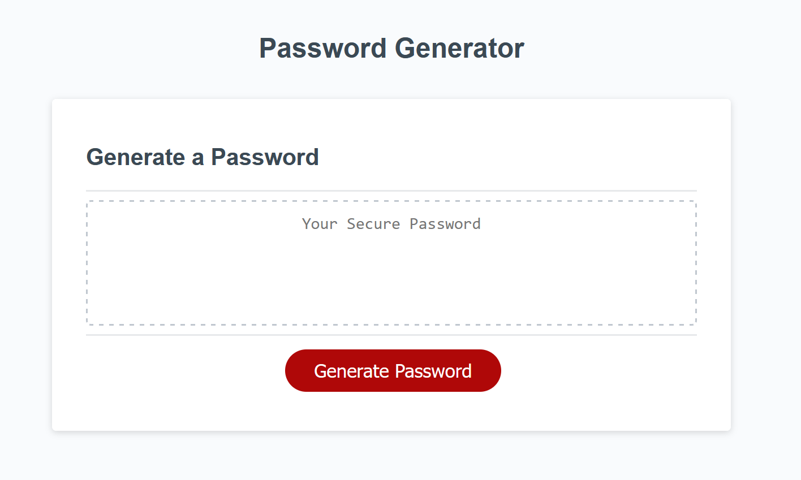

# Password Generator

## Description

In this challenge I was given starter code that displays a button marked "password generator". I was tasked with using this starter code to make the button a functional password generator. When the button is clicked it should prompt the user to set a length for the password and ask for what character sets to use. The available character sets are lowercase, uppercase, numeric, and special characters.

### URL

https://bluskreen.github.io/jason-duran-portfolio/

